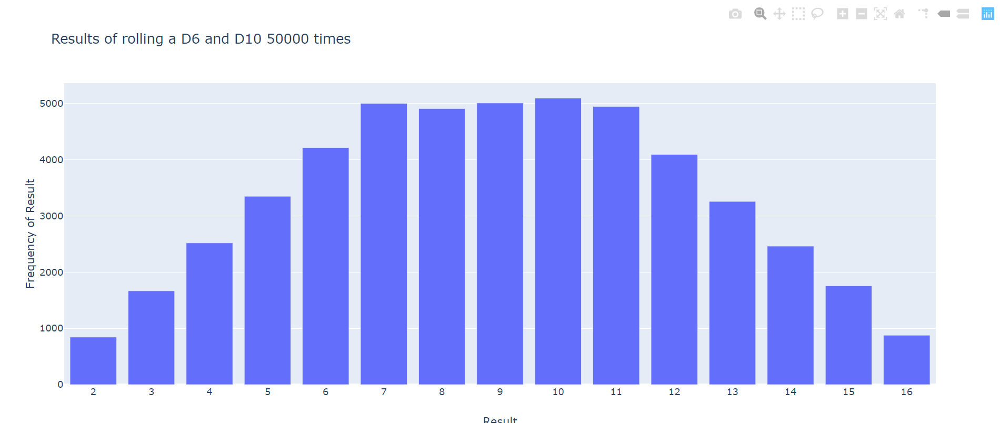
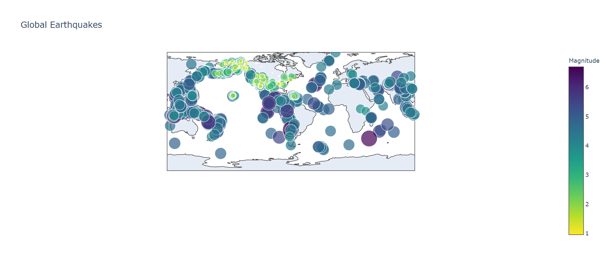
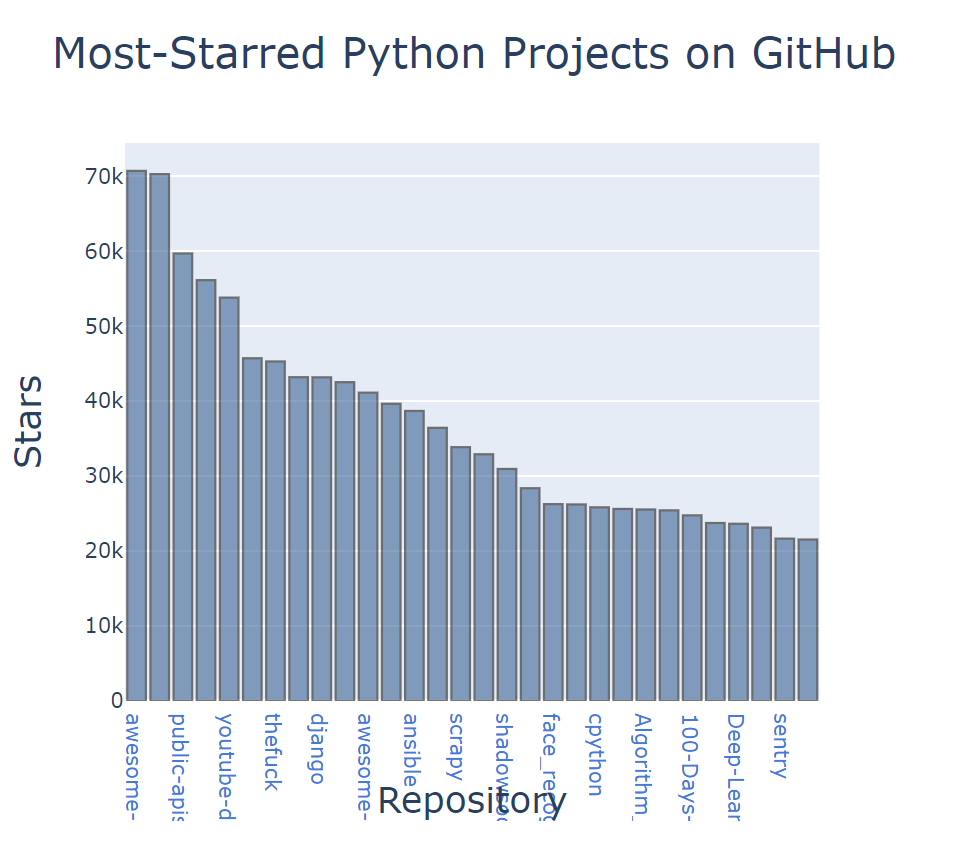

# Data Visualization

## Exercises for chapters: 15 Generating Data 
### Rolling Dice with Plotly

## Exercises for chapters: 16 Downloading Data
### Mapping Global Data Sets: JSON Format
Download a JSON data set representing all the earthquakes in amonth and display the markers in a map using Plotly.

## Exercises for chapters: 17 Working with APIs
### Visualizing Repositories Using Plotly
Using GitHub API to customize the chart's apperance with Plotly. 

